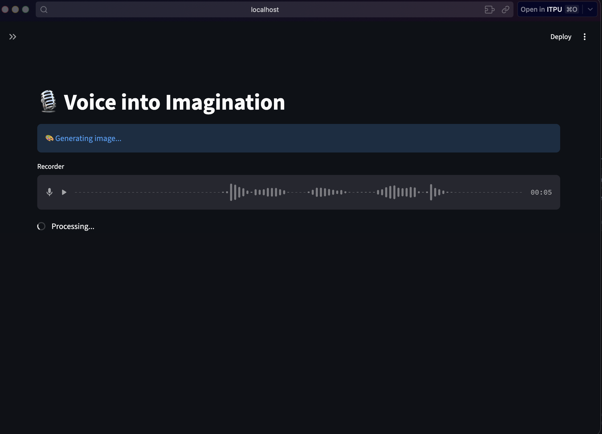
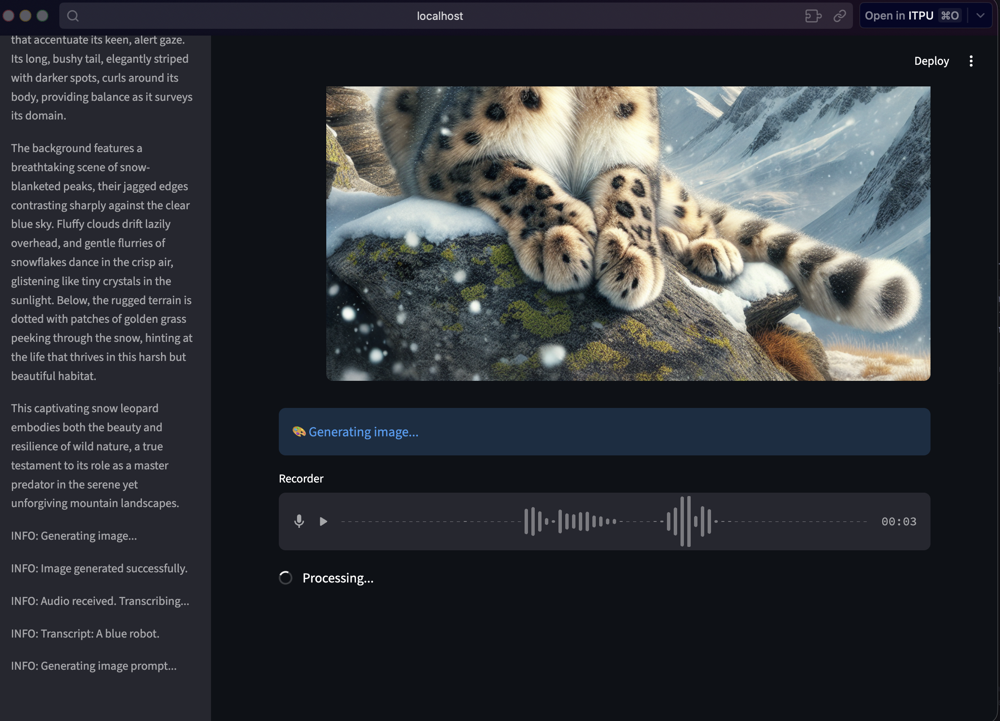
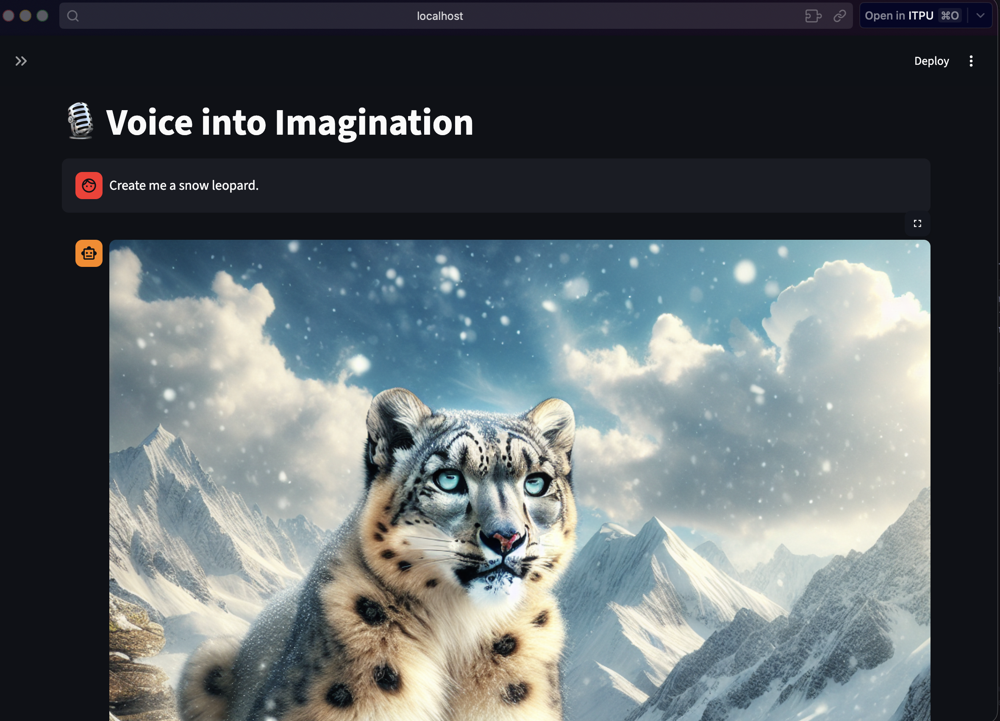

# 🎙️ Voice into Imagination

**Voice into Imagination** is a sophisticated AI-powered application that transforms your spoken words into vivid, high-quality images. By blending voice transcription, natural language understanding, and state-of-the-art image synthesis, it provides a seamless bridge between thought and visualization.

---

## [Hugging Face](https://huggingface.co/spaces/niddijoris/VoiceToImage)


## 🛠️ How It Works

The application utilizes a multi-stage pipeline to process your input:

1.  **Voice Capture**: High-fidelity audio recording through Streamlit's interface.
2.  **Transcription**: Speech-to-text conversion powered by **OpenAI Whisper**.
3.  **Prompt Engineering**: **GPT-4o-mini** refines your transcript into a detailed, visually-rich image prompt.
4.  **Image Synthesis**: **DALL·E 3** generates a high-resolution 1024x1024 image based on the refined prompt.

---

## 📸 Real Usage Example & Workflow

Follow this step-by-step workflow to see the magic in action.

### 1. Speak Your Idea
Open the app and use the **Recorder** at the bottom. Simply click the microphone icon and describe the image you want to see.


*Status: Capturing audio and preparing for transcription.*

### 2. Live Processing
The system provides real-time feedback. It transcribes your voice and displays what it understood. You'll see a success message showing your captured text.


*Status: System logs show the internal operations (sidebar) while the main UI displays the transcribed text.*

### 3. Behold the Result
The agent generates a detailed prompt and creates your image. The results are displayed in a clean, chat-like interface.


*Example: "Create me a snow leopard" transformed into a stunning mountain scene.*

### 4. Continuous Interaction
You can keep adding more images or refining your ideas. All system logs are tracked in the sidebar to ensure transparency.


*Example: Following up with "A blue robot."*

---

## 🚀 Getting Started

### Prerequisites

- Python 3.9+
- OpenAI API Key

### Installation

1.  **Clone the repository** (or download the source).
2.  **Install dependencies**:
    ```bash
    pip install -r requirements.txt
    ```
3.  **Configure environment**:
    Copy `.env.example` to `.env` and add your `OPENAI_API_KEY`:
    ```bash
    cp .env.example .env
    ```
4.  **Run the application**:
    ```bash
    streamlit run app.py
    ```

---

## 📂 Project Structure

- `app.py`: Main Streamlit interface with custom chat UI.
- `agent.py`: Core logic for Whisper, GPT-4, and DALL·E integration.
- `.screenshots/`: Documentation assets showing the app in action.
